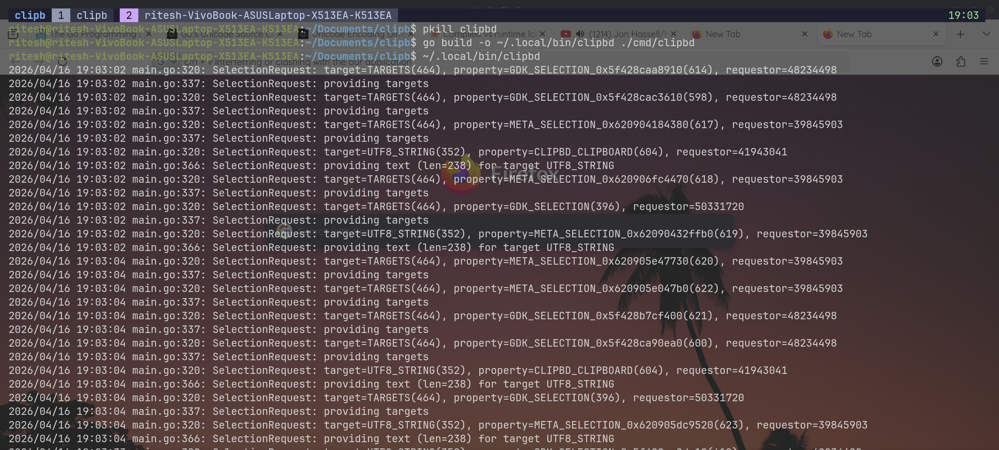

# Why DynamoDB dropped ACID - dity





## The core


Built a bank transfer system that manually shards data across 3 independent PostgreSQL databases and the app will decide where the data live and how to keep it consistent

## 1. The Shard router

Every account is assigned to a shard by a simple hash

```go
func ShardIndex(userID int64) int {
    return int(userID % NumShards) // 0, 1, or 2
}
```

So user0, user3, user6 will be going to shard0, user1, user4, user7 will be going to shard1... Its simple and fast but it means two random users will be on different shards ~67% of the time making the cross shard transfers the common case and not the exception

If you have **N** shards and users are distributed randomly the probability **P** that a transfer stays on the same shard is simply

**P = 1/N**

Here with 3 shards we are hitting the slow cross shard path **67%** of the time. If I decide to make it grow to 10 shards to handle more traffic that number jumps to **90%**. But as per white papers on Database sharding, a perfected sharded db would co-locate "frequent transactions" (like a account holder and its nominees) on the same shard but the **MATH WON'T BE MATHING HERE !!** And yeaah this is something called **SHARDING TAX** 0.0

> Sources : Why Sharding is bad for business By Cockroach Labs

## 2. Same Shard Transfer

When both accounts land on the same shard, we get real database transaction without any extra work

```go
func (s *Store) TransferSameShard(ctx context.Context, from, to int64, amount int64) error {
    shardIdx := ShardIndex(from)
    db := s.shards[shardIdx]

    tx, err := db.BeginTx(ctx, nil)
    if err != nil {
        return err
    }
    defer tx.Rollback()

    // Debit
    _, err = tx.ExecContext(ctx,
        "UPDATE accounts SET balance = balance - $1 WHERE id = $2", amount, from)
    if err != nil {
        return err
    }

    // Credit
    _, err = tx.ExecContext(ctx,
        "UPDATE accounts SET balance = balance + $1 WHERE id = $2", amount, to)
    if err != nil {
        return err
    }

    return tx.Commit()
}
```

> **Note:** This is the happy path. One database, one transaction, full ACID guarantees. PostgreSQL handles rollback on failure automatically.

## Math test

Inline: $E = mc^2$

Block:

$$
\int_{-\infty}^{\infty} e^{-x^2} dx = \sqrt{\pi}
$$

Sharding probability:

$$
P(\text{same shard}) = \frac{1}{N}
$$

With $N = 3$, cross-shard probability is $1 - \frac{1}{3} = \frac{2}{3} \approx 67\%$.
