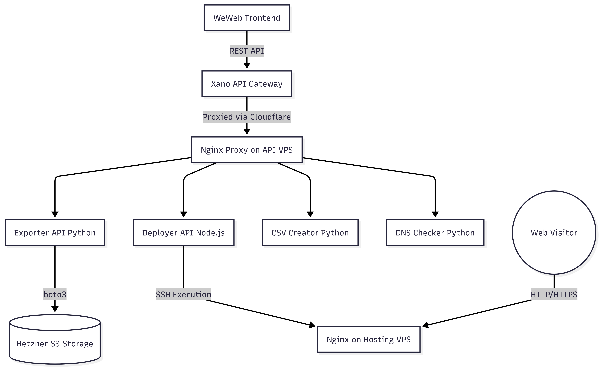
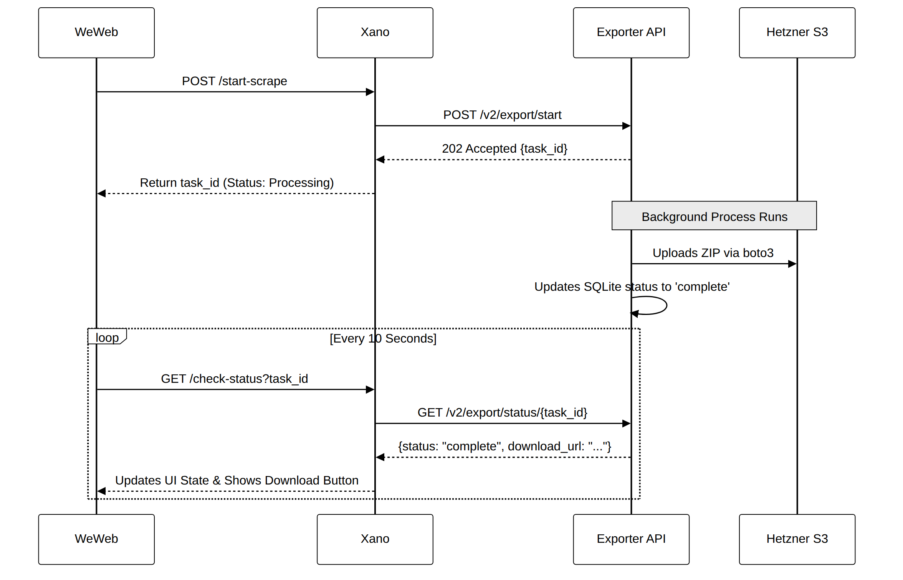
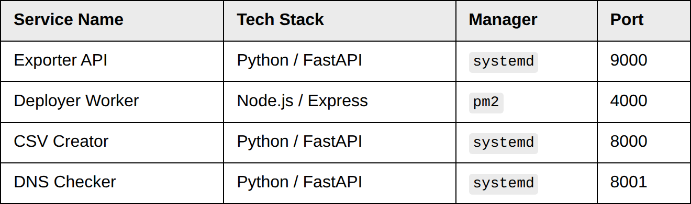

# Building a Scalable Webflow Extractor & Deployment Platform

An architectural deep dive into decoupling No-Code frontends, overcoming hard network timeouts, and automating remote server deployments across a custom Linux microservice cluster.

---

## 1. Summary

This document details the architecture of a highly decoupled, distributed SaaS platform. The system is designed to perform resource-intensive web scraping tasks, process massive datasets, and completely automate remote server deployments.

To achieve horizontal scalability and fault tolerance, the platform implements a strict separation of concerns. By utilizing a custom asynchronous polling architecture, it successfully bypasses standard HTTP 504 gateway timeouts. The stack relies on WeWeb for the UI, Xano for data orchestration, and custom Linux VPS instances for heavy computation, deployment execution, and file hosting.

## 2. Global System Architecture

The system is physically divided into three distinct planes: The Client Plane (WeWeb), the Orchestration Plane (Xano), and the Server Plane (Hetzner VPS instances). **WeWeb never communicates with the Hetzner servers directly. Xano acts as the sole secure API gateway.**

The Control Plane API VPS runs four independent microservices to handle specialized workloads:

- **Exporter API:** The core Python engine. It handles heavy, long-running Playwright web scraping jobs, zips the assets, and streams them to S3 storage.
- **Deployer Worker:** A Node.js service that acts as an automated SysAdmin. It connects to the secondary hosting server via SSH to execute shell commands, creating folders and unpacking websites on demand.
- **CSV Creator:** A Python utility API that receives complex, nested JSON arrays from Xano and flattens them into downloadable CSV or Excel files.
- **DNS Checker:** A Python service that performs raw DNS queries to verify if a user has correctly pointed their domain's A-record to our hosting infrastructure.



## 3. The Asynchronous "Fire-and-Poll" Workflow

> **Architectural Note:** Initially, the scraping architecture was synchronous. However, scraping massive websites generated files exceeding 250MB and processing times over 3 minutes. This triggered hard 100-second `504 Gateway Timeouts` at the Cloudflare and Xano infrastructure layers. The architecture was fundamentally rewritten to an asynchronous polling model. Do not attempt to revert this to a synchronous HTTP call.

To ensure 100% reliability for long-running jobs, the system separates the control signal from the data payload.



## 4. Microservices Overview (Control Plane)

All microservices are hosted on a single Ubuntu VPS, sitting behind an Nginx reverse proxy that routes traffic based on subdomains.



- **Exporter API** — Python / FastAPI, managed by `systemd`, port `9000`
- **Deployer Worker** — Node.js / Express, managed by `pm2`, port `4000`
- **CSV Creator** — Python / FastAPI, managed by `systemd`, port `8000`
- **DNS Checker** — Python / FastAPI, managed by `systemd`, port `8001`

## 5. "One-Click" Infrastructure Automation (Hosting Plane)

**What is it?**

The Hosting Plane is a dedicated, separate Hetzner VPS whose sole job is to serve static HTML/CSS files to the public internet. It operates entirely independently of the API Control Plane.

**Why did we need it?**

When a user successfully exports a project, they want to make it live on their own custom domain (e.g., `www.client-site.com`). In a traditional setup, a systems administrator would have to manually log into the server, write a new Nginx configuration file for `client-site.com`, provision an SSL certificate, and restart the server. This manual process is unscalable for a SaaS platform. We needed a system where the user performs one action (pointing their DNS to our IP), and our server automatically knows how to serve their files without requiring server restarts or new config files.

**How it works: The Wildcard Nginx Configuration**

To achieve this, the Hosting VPS is configured with a "catch-all" Nginx server block. Instead of hardcoding domain names, Nginx uses the incoming HTTP `Host` header to dynamically determine which folder to serve files from.

```bash
# /etc/nginx/sites-available/wildcard-hosting
server {
    listen 80;
    server_name _; # The underscore catches ANY domain

    # Nginx dynamically sets the root path based on the user's domain
    root /var/www/$host;
    index index.html;

    # Implements "Pretty URLs" (Extensionless routing)
    location / {
        try_files $uri $uri.html $uri/ /index.html =404;
    }
}
```

When the user clicks "Deploy" in WeWeb, our Node.js Deployer Worker SSHs into this server and runs commands to create a folder matching the user's domain (e.g., `mkdir /var/www/client-site.com`) and unzips the files there. When a web visitor navigates to `client-site.com`, Nginx reads the host header, maps it to that exact folder, and serves the site instantly.

## 6. CI/CD & Secrets Management

> **SECURITY PROTOCOL:** `.env` files containing S3 keys and SSH passwords are strictly forbidden in version control. A BFG Repo-Cleaner operation was performed to rewrite Git history and purge legacy secrets. Do not commit local environment variables.

Deployments are automated via GitHub Actions. The pipeline ensures zero-downtime deployments and dynamic secret injection. During deployment, the GitHub runner reads securely stored Repository Secrets and dynamically writes the `.env` file directly onto the host machine before restarting the daemons.

### Deployment Workflow (`deploy.yml`)

1. Trigger: Push to `main` branch.
2. Connect: GitHub runner connects to the API VPS via `appleboy/ssh-action`.
3. Clean: Executes `sudo git clean -dfx` to purge untracked artifacts (preventing disk bloat from old cache files).
4. Pull: `git fetch` and `git reset --hard origin/main`.
5. Secret Injection: The pipeline reads GitHub Repository Secrets (e.g., `HETZNER_S3_SECRET_KEY`) and dynamically executes `echo "KEY=VALUE" >> .env` directly on the host machine.
6. Rebuild: Recreates the Python `.venv`, reinstalls `requirements.txt`, and runs `playwright install chromium`.
7. Restart: Issues `sudo systemctl restart [service]` or `pm2 restart [service]`.

## 7. Operations & Incident Response

### Service Restarts

To restart the Node.js services (Deployer API):

```bash
pm2 restart deployer-api
```

To restart the Python services (e.g., Exporter API):

```bash
sudo systemctl restart exporter.service
```

### Tailing Live Logs

If a scrape is failing, tail the systemd journal for the Python process to view the traceback:

```bash
sudo journalctl -u exporter.service -f -n 100
```

### Diagnosing Out-Of-Memory (OOM) Kills

Heavy Playwright scraping instances can consume significant RAM. If the exporter service connection drops unexpectedly without a Python error log, the Linux kernel may have killed the process. Check the kernel logs for OOM events:

```bash
sudo dmesg -T | grep -i kill
```

## About Me

Hey, I'm Ritesh Shukla. I'm 21 years old and I spend my time building cool, sophisticated software—mostly leveraging AI to move faster and build better.

I love diving into projects that get incredibly complex in terms of backend depth and infrastructure, but I always keep an eye on good frontend design, too. I'm currently diving deep into system design and constantly experimenting with new ways to structure and build apps.

If you want to chat about tech, share ideas, or just connect, feel free to reach out.

**Email:** [riteshuklaa@gmail.com](mailto:riteshuklaa@gmail.com)
